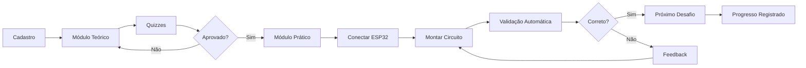

# Ninho Academy


Plataforma educacional desenvolvida na disciplina **Certificadora da Competência 2** do curso de Engenharia de Computação da **UTFPR – Câmpus Cornélio Procópio**. A ideia é facilitar o processo de aprendizagem para quem está começando do universo de eletrônica, algoritmos e circuitos, com o uso do ESP32.

🌐 **Acesse a plataforma:** [http://ninho-academy.43464994.xyz/](http://ninho-academy.43464994.xyz/)

---

## 📖 Sobre o Projeto

O **Ninho Academy** é uma plataforma educacional completa que aproxima estudantes iniciantes dos fundamentos de algoritmos e análise de circuitos, oferecendo uma trilha de aprendizado teórico e prático com ESP32, de forma fácil e progressiva.

### Objetivos principais

- oferecer uma jornada acessível, com linguagem direta e exemplos reais;
- estimular o raciocínio lógico e o entendimento de conexões elétricas básicas;
- integrar site, software e ESP32 para que cada passo teórico seja testado imediatamente;
- apoiar professores e monitores com acompanhamento de progresso em tempo real.

---

## 2. O que o estudante encontra

### Módulo teórico

Conteúdos curtos, progressivos e focados em iniciantes. São abordados GPIO, leitura analógica (ADC), PWM introdutório, comunicação serial e cuidados essenciais de alimentação e aterramento. Cada bloco termina com um quiz simples: acertou, segue em frente; errou, recebe feedback instantâneo.

### Módulo prático

Depois de liberar a parte teórica, o aluno conecta o ESP32 ao computador e segue instruções guiadas. A plataforma verifica erros comuns (pino errado, falta de resistor, ligação invertida) e explica como corrigir antes de avançar. Os desafios iniciais incluem acender LEDs, ler botões com pull-up/pull-down e controlar brilho via PWM.

---

## 3. Arquitetura em alto nível

```text
ninho-academy/
├─ frontend/   # React + Vite + Tailwind
├─ backend/    # Node.js + Express + Prisma (SQLite)
└─ firmware/   # C++ (PlatformIO) para ESP32
```

- **Frontend**: React 18 com TypeScript e TailwindCSS, rodando como SPA.
- **Backend**: API REST em Node.js, usando Prisma ORM com SQLite (fácil migrar para PostgreSQL).
- **Firmware**: Código em C++ carregado no ESP32 via PlatformIO, responsável por reportar telemetria e receber comandos.
- **Comunicação**: Web Serial API no navegador + API REST + protocolo JSON para eventos e telemetria.

---

## 4. Ambiente de desenvolvimento

### Requisitos básicos

- Node.js 18+
- npm
- VS Code com extensão PlatformIO (para trabalhar o firmware)
- ESP32 conectado via USB quando quiser testar a parte prática

### Passo a passo

#### Backend

```bash
cd backend
npm install
npx prisma db push   # cria ou atualiza o SQLite
npm run dev
```

#### Frontend

```bash
cd frontend
npm install
npm run dev
```

#### Firmware

1. Abra a pasta `firmware/` no VS Code com PlatformIO instalado.
2. Conecte o ESP32 e clique em **Upload** (ícone de seta) para gravar o código.
3. Use o Serial Monitor em 115200 baud para acompanhar as mensagens (o firmware envia JSON a cada ~500 ms).

---

## 5. Deploy

### Frontend (deploy)

Gerar build estática e publicar em qualquer serviço de hosting.

```bash
cd frontend
npm run build
```

### Backend (deploy)

- **SQLite com volume persistente**: use Docker garantindo armazenamento do arquivo `database.sqlite` e rodando `npx prisma migrate deploy` na inicialização.
- **PostgreSQL (preferido para produção)**: altere o provider no `schema.prisma`, configure `DATABASE_URL` e faça deploy.

---

## 6. Fluxo de aprendizagem


