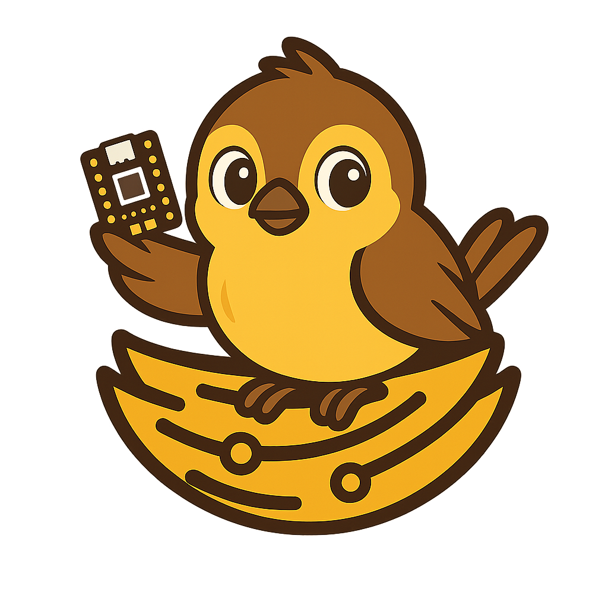

<div align="center">
  

  # Ninho Academy

  **Plataforma educacional para ensino de eletrônica e programação embarcada com ESP32**

  [](http://ninho-academy.43464994.xyz/)
  [](LICENSE)

</div>

---

## Sobre o Projeto

O **Ninho Academy** é uma plataforma educacional interativa que combina teoria e prática para ensinar fundamentos de eletrônica e programação embarcada. Desenvolvido com foco em estudantes iniciantes, o projeto utiliza o microcontrolador ESP32 para proporcionar uma experiência hands-on de aprendizado.

### Objetivos

- Ensinar conceitos básicos de eletrônica de forma prática e visual
- Integrar teoria com montagem de circuitos reais usando ESP32
- Implementar sistema de gamificação para motivar e engajar estudantes
- Fornecer acompanhamento detalhado de progresso do aluno
- Criar missões práticas para consolidação do conhecimento

### Funcionalidades

- Interface web moderna e responsiva
- Sistema de missões práticas com validação automática
- Comunicação em tempo real com dispositivos ESP32 via WebSocket
- Controle de componentes eletrônicos (LED, Buzzer, Sensores)
- Sistema de autenticação e gerenciamento de usuários
- Acompanhamento de progresso por missão

## Estrutura do Projeto

```
ninho-academy/
├─ frontend/          # Aplicação React
│  ├─ src/
│  │  ├─ components/  # Componentes reutilizáveis
│  │  ├─ pages/       # Páginas da aplicação
│  │  └─ services/    # Serviços e APIs
│  └─ assets/         # Imagens e recursos estáticos
│
├─ backend/           # API REST
│  ├─ src/
│  │  ├─ routes/      # Rotas da API
│  │  ├─ models/      # Modelos de dados
│  │  └─ services/    # Lógica de negócio
│  └─ database/       # Banco de dados SQLite
│
└─ firmware/          # Código para ESP32
   ├─ src/
   │  ├─ ninho/       # Biblioteca Ninho
   │  └─ main.cpp     # Programa principal
   └─ platformio.ini  # Configuração PlatformIO
```

## Tecnologias Utilizadas

### Frontend
- **React 18** - Biblioteca para interfaces de usuário
- **Vite** - Build tool e dev server
- **Tailwind CSS** - Framework CSS utilitário
- **Lucide React** - Ícones
- **Axios** - Cliente HTTP

### Backend
- **Node.js** - Runtime JavaScript
- **Express 5** - Framework web
- **SQLite** - Banco de dados
- **JWT** - Autenticação
- **bcrypt** - Hash de senhas

### Firmware
- **PlatformIO** - Plataforma de desenvolvimento para IoT
- **Arduino Framework** - Framework para ESP32
- **ArduinoJson** - Manipulação de JSON

## Como Rodar

### Requisitos

- **Node.js** 18 ou superior
- **npm** ou **yarn**
- **PlatformIO** (para firmware)

### 1. Backend

```bash
cd backend
npm install
npm run dev
```

O backend estará rodando em `http://localhost:3001`

### 2. Frontend

```bash
cd frontend
npm install
npm run dev
```

O frontend estará rodando em `http://localhost:5173`

### 3. Firmware (ESP32)

```bash
cd firmware
pio run --target upload
pio device monitor
```

O firmware será compilado e enviado para o ESP32 conectado via USB.

## Deploy

A aplicação está disponível online em: **[http://ninho-academy.43464994.xyz/](http://ninho-academy.43464994.xyz/)**

## Licença

Este projeto está sob a licença MIT. Veja o arquivo [LICENSE](LICENSE) para mais detalhes.

---

<div align="center">
  Feito com ❤️ pela equipe Ninho Academy
</div>
